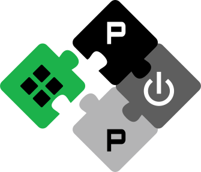

# Bender

**A dependency management tool for hardware design projects.**

Bender manages HDL package dependencies across Git repositories and local paths, resolves compatible versions, records the exact result in `Bender.lock`, and collects ordered source sets for downstream tools. It is designed to fit existing hardware flows rather than impose a registry, directory layout, or simulator choice.


[](https://crates.io/crates/bender)
[](#license)

## Why Bender

- **Reproducible dependency resolution:** Resolve IP dependencies from Git tags, revisions, or local paths and record the exact state in `Bender.lock`.
- **HDL-aware source collection:** Keep source ordering, include directories, defines, and target-specific file groups in one place.
- **Tool-agnostic workflow:** Generate inputs for QuestaSim, VCS, Vivado, Verilator, and other flows without forcing a particular setup.
- **Practical local development:** Work on dependencies locally and modify them conveniently as part of your development flow.

## Quick Start

Install Bender:

```sh
curl --proto '=https' --tlsv1.2 https://pulp-platform.github.io/bender/init -sSf | sh
```

Create a package:

```sh
mkdir my_ip
cd my_ip
bender init
```

Add a dependency to `Bender.yml`:

```yaml
dependencies:
  common_cells: { git: "https://github.com/pulp-platform/common_cells.git", version: "1.21.0" }
```

Resolve dependencies and generate a compile script:

```sh
bender update
bender script vsim > compile.tcl
vsim -do compile.tcl
```

## How It Works

Bender packages are built around three files:

- `Bender.yml`: Declares package metadata, dependencies, sources, targets, and workflow configuration.
- `Bender.lock`: Records the exact resolved dependency revisions for reproducible builds.
- `Bender.local`: Stores local overrides, for example when developing a dependency in-place.

In a typical workflow, you edit `Bender.yml`, run `bender update` to resolve dependencies, use `bender checkout` to download the revisions pinned in `Bender.lock`, and generate tool inputs with `bender script`.

## Documentation

The full documentation lives at **[pulp-platform.github.io/bender/](https://pulp-platform.github.io/bender/)**.

- [Installation](https://pulp-platform.github.io/bender/installation.html)
- [Getting Started](https://pulp-platform.github.io/bender/getting_started.html)
- [Concepts](https://pulp-platform.github.io/bender/concepts.html)
- [Workflows](https://pulp-platform.github.io/bender/workflows.html)
- [Commands](https://pulp-platform.github.io/bender/commands.html)

## License

Bender is licensed under either of:

- Apache License, Version 2.0 ([LICENSE-APACHE](LICENSE-APACHE) or http://www.apache.org/licenses/LICENSE-2.0)
- MIT license ([LICENSE-MIT](LICENSE-MIT) or http://opensource.org/licenses/MIT)

at your option.

---

<a href="https://pulp-platform.org/">

</a>

Bender is maintained by the [PULP Platform](https://pulp-platform.org/) at ETH Zurich and the University of Bologna.
